"""# 🧠 Big-Five Personality Type Predictor

Ein End-to-End Machine Learning System zur Vorhersage von Persönlichkeitstypen basierend auf dem Big-Five (OCEAN) Fragebogen. Das Projekt umfasst den gesamten Workflow von der explorativen Datenanalyse (EDA) über Scikit-Learn Preprocessing Pipelines, Experiment-Tracking mit MLflow bis hin zum Deployment einer interaktiven Streamlit Web-App.

---

## 📁 Projektstruktur

personality-type-predictor/
├── .gitignore             # Schließt .venv, mlflow.db und mlruns aus
├── README.md              # Projekt-Dokumentation & Anleitungen
├── requirements.txt       # Gepinnte Python-Abhängigkeiten
├── eda.ipynb              # Explorative Datenanalyse & Missing Value Check
├── modeling.ipynb         # Preprocessing Pipeline, Modellvergleich & MLflow Tracking
├── app.py                 # Streamlit Web-App für Live-Predictions
└── data/
    ├── data.csv           # Rohdaten
    └── data_processed.csv # Aufbereiteter Handoff-Datensatz

---

# Phase 1: Explorative Datenanalyse (EDA) & Preprocessing-Vorbereitung

## Ziele dieses Notebooks:
* **Rohdaten laden & Struktur verstehen:** Form des Datensatzes (`shape`), Datentypen (`dtypes`) und erste Zeilen prüfen.
* **Qualitätscheck:** Fehlende Werte (`missing values`), unmögliche Werte (z. B. negatives Alter oder unbekannte Kategorien) identifizieren.
* **Zielvariable analysieren:** Die Verteilung der Zielklasse (`target`) untersuchen und auf ein Klassenungleichgewicht (*Class Imbalance*) prüfen.
* **Cleaned Dataset exportieren:** Die bereinigten Daten als `data/data_processed.csv` abspeichern – dies bildet die Schnittstelle für das spätere Training in `modeling.ipynb`. 
* **`target` hat 4 Unikate (`unique = 4`).**
* **Die häufigste Klasse ist Moderate mit 8.452 Einträgen (von insg. 19.719).**
* ***Das bestätigt eindeutig das vorhergesagte Klassenungleichgewicht (Class Imbalance):*** Moderate macht über 42 % aller Datenpunkte aus, während die anderen drei Typen deutlich seltener vorkommen. Genau deshalb werden wir später beim Modellieren nicht die einfache Accuracy als Metrik nutzen, sondern den F1-Macro-Score!

## Explizite Prüfung auf 'Missing Values'
* **'Best Practice'** (obwohl der Datensatz sehr gut aussieht)
* **Imputation erfolgt erst in der `modeling.ipynb`**, um Data Leakage zwischen Train- und Testdaten zu vermeiden
* **Der Datensatz wurde auf unplausible Ausreißer oder beschädigte Zeilen geprüft**, ist gereinigt und bereit für die Scikit-Learn Preprocessing Pipeline in `modeling.ipynb`.
* ***Zum Schluss noch die Visualisierung der Target-Gruppen und der Altersverteilung im Testdatensatz als Histogramme.***

---

# Phase 2: Preprocessing Pipeline, Modellierung, Hyperparameter-Tuning & MLflow Tracking

## Ziele dieses Notebooks:
* **Daten laden:** Aufbereiteten Datensatz `data/data_processed.csv` importieren.
* **Preprocessing Pipeline aufbauen:** Numerische Spalten (Fragen N1-A4 + Age) median-imputieren und skalieren (`StandardScaler`); kategoriale Spalten (`gender`, `hand`) mode-imputieren und one-hot-kodieren (`OneHotEncoder`).
* **Baseline-Vergleich:** Mehrere Modelle (z. B. RandomForest, LogisticRegression) per 5-Fold Cross-Validation anhand des `F1-Macro`-Scores evaluieren.
* **Hyperparameter-Tuning & Experiment Tracking:** Ausgewählte Modelle tunen und jeden Run mit Parametern, Metriken und Modell-Artefakten in **MLflow** aufzeichnen.
* **Champion-Wahl:** Bestes Modell für das spätere Deployment in der Streamlit-App identifizieren.

### Wir nutzen `cross_val_score` statt ein einfaches `model.fit()`
* **Wenn wir ein Modell nur einmal auf einem festen Train/Test-Split trainieren (`fit`),** hängt die Bewertung stark vom Zufall ab (welche Daten landeten im Test-Set?).
* **`cross_val_score` führt eine 5-Fold Cross-Validation (5-fache Kreuzvalidierung) durch:**
  * Der gesamte Datensatz wird in 5 gleich große Teile (Folds) aufgeteilt.
  * **Durchlauf 1:** Ordner 1-4 werden zum Trainieren genutzt (`.fit()`), Ordner 5 zum Testen (`.predict()`).
  * **Durchlauf 2:** Ordner 1, 2, 3, 5 werden zum Trainieren genutzt, Ordner 4 zum Testen.
  * **Das wird wiederholt,** bis jeder Ordner einmal als Testset diente. Am Ende berechnet `cross_val_score` den Durchschnitt der 5 Ergebnisse (`.mean()`).

### In `cross_val_score()` laufen im Hintergrund automatisch folgende Schritte ab:
1. **Splitting (Aufteilung):** Die Daten werden in K Blöcke (Folds) unterteilt (bei `cv=5` also in 5 gleich große Teile). Durch die Strategie `StratifiedKFold` wird sichergestellt, dass das Mischungsverhältnis der 4 Zielklassen in jedem Block identisch ist.
2. **`fit()` (Training):** Das Modell wird auf K-1 Blöcken trainiert (z. B. auf Block 1, 2, 3 und 4).
3. **`predict()` (Vorhersage):** Das trainierte Modell sagt die Ergebnisse für den übrig gebliebenen, für das Modell unbekannten Block (z. B. Block 5) voraus.
4. **Metrik berechnen:** Der F1-Score wird ausschließlich auf diesem unbekannten Validierungsblock berechnet.

Dieser Prozess wird K-mal wiederholt, sodass jeder Block genau einmal als ungesehenes Test-Set dient.

***Was bedeutet das für unser finales Modell?***
`cross_val_score()` dient nur zur fairen Bewertung der Modellleistung – es speichert am Ende kein einzelnes, fertiges Modell ab.

**Damit wir unser bestes Modell (`HistGradientBoostingClassifier`) später in der Streamlit-App verwenden können, führen wir als Nächstes ein explizites `fit()` auf den gesamten Daten durch und loggen dieses fertige Modell-Artefakt direkt in MLflow!**
"""

```mermaid
flowchart TD
    %% Phase 1: Environment & Repository
    subgraph P1 ["1. Setup & Environment (Linux)"]
        A1([Start: Neues Projekt auf Linux]) --> A2[Projektordner erstellen & betreten: <br>mkdir personality-predictor && cd ...]
        A2 --> A3[Virtuelle Umgebung anlegen: <br>python3 -m venv .venv]
        A3 --> A4[.venv explizit aktivieren: <br>source .venv/bin/activate]
        A4 --> A5[Git Repository initialisieren: <br>git init]
        A5 --> A6[Pakete installieren: <br>pip install -r requirements.txt]
    end

    subgraph P2 ["2. Data Pipeline & EDA"]
        A6 --> B1[Rohdaten ablegen: data/data.csv]
        B1 --> B2[Jupyter / VS Code starten & eda.ipynb ausführen]
        B2 --> B3[Data Cleaning & Missing Value Check]
        B3 --> B4[Bereinigten Datensatz exportieren: <br>data/data_processed.csv]
    end

    subgraph P3 ["3. Modeling & MLflow"]
        B4 --> C1[modeling.ipynb ausführen]
        C1 --> C2[Preprocessing Pipeline definieren: <br>ColumnTransformer]
        C2 --> C3[Model Evaluation: <br>5-Fold StratifiedKFold CV - F1-Macro Score]
        C3 --> C4[MLflow Server / Tracking starten & Run loggen: <br>mlflow.sklearn.log_model]
        C4 --> C5[Champion Run ID kopieren]
    end

    subgraph P4 ["4. Deployment & Version Control"]
        C5 --> D1[app.py mit Run ID konfigurieren]
        D1 --> D2[Streamlit lokal testen: <br>streamlit run app.py]
        D2 --> D3[Git Stage & Commit: <br>git add . && git commit]
        D3 --> D4[GitHub Remote verknüpfen & pushen: <br>git push -u origin main]
        D4 --> D5([Ziel erreicht: Production Ready auf Linux])
    end
```

